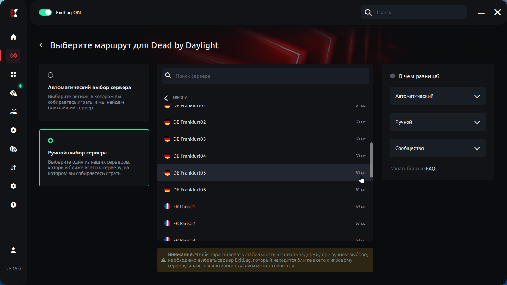

Привет, это краткий гайд для ExitLag на примере Dead by Daylight.

Ссылка на ExitLag: https://exitlag.com

[Просто скажи что мне поставить чтоб всё работало!](#что-мне-поставить-чтобы-всё-работало-без-лишних-разъяснений)

[Пошаговая инструкция](#пошаговая-инструкция)
* [Шаг 1](#шаг-1-открыть-exitlag-перейти-в-библиотеку-и-в-строке-поиска-найти-нужную-вам-игру-и-кликните-по-ней)
* [Шаг 2](#шаг-2-выбрав-нужную-игру-нажмите-на-выберите-регион-или-сервер)
* [Шаг 3 (ВАЖНО)](#шаг-3-кликните-на-расширенные-настройки-и-в-открывшемся-меню-выберите-следующие-настройки)

[Подробное объяснение настроек и почему это важно](#почему-именно-так-подробное-объяснение-настроек)
* [Почему Франкфурт](#почему-франкфурт)
* [Почему Обязательно следут отключить местные маршруты](#почему-обязательно-следует-выключить-сначала-использовать-местные-маршруты)
* [Почему Обязательно следует включить "Перенаправления подключения для выхода в игру"](#почему-обязательно-следует-включить-перенаправлять-подключения-для-входа-в-систему) 
* [TCP и UDP Маршруты](#tcp-и-udp-маршруты)


## Что мне поставить чтобы всё работало, без лишних разъяснений.

### Правильная настройка:
    
    Сервер: Eвропа (Франкфурт)

    Расширенные настройки:
    Сначала использовать местные маршруты: ❌ (Обязательно отключить)

    Перенаправлять подключения для входа в систему: ✅ (Обязательно включить)

    Маршруты TCP: 1
    Маршруты UDP: 2-3 
    

### В итоге должно получиться:


### Не забудьте применить маршруты


## Пошаговая инструкция

### Шаг 1: Открыть ExitLag, перейти в библиотеку и в строке поиска найти нужную вам игру и кликнуть по ней.


### Шаг 2: Выбрав нужную игру нажмите на "Выберите регион или сервер".


### Шаг 2.1: Кликните на "Ручной режим выбора сервера" и выберите Сервер: Европа (Франкфурт).




### Шаг 3: Кликните на "Расширенные настройки" и в открывшемся меню выберите следующие настройки:

```
Сначала использовать местные маршруты: ❌ (Обязательно отключить)

Перенаправлять подключения для входа в систему: ✅ (Обязательно включить)

Маршруты TCP: 1
Маршруты UDP: 2-3 (2 или 3 в зависимости от вашего интернета и состояния серверов)
```


### Шаг 4: Кликните на "Применить маршруты"


## Почему именно так? (подробное объяснение настроек).

### Почему Франкфурт?

У вас мог возникнуть вопрос: "Почему именно Франкфурт, а не другой город с лучшим пингом по типу Стокгольма?"

Всё дело в том что при выборе Стокгольма мы столкнёмся тем что нас будет подключать к СНГ маршрутам, из-за чего у нас будет плохой пинг или игра вообще не будет работать


Как видно на фото по мимо маршрутов Стокгольма появились так же маршруты из Москвы и Питера

Именно поэтому лучше выбрать Франкфурт (Или любой другой подходящий для вас регион не подключающийся к СНГ)


### Почему обязательно следует ВЫКЛЮЧИТЬ "Сначала использовать местные маршруты"?

При включении этот параметр будет использовать местные маршруты для подключения к серверу, что может не позволить вам зайти в игру или нарушить ее работу. Поэтому обязательно выключите этот параметр.

### Почему обязательно следует ВКЛЮЧИТЬ "Перенаправлять подключения для входа в систему"?

Без перенаправления ExitLag оптимизирует только те порты/протоколы, которые вы явно указали в настройках профиля. Остальной трафик (авторизация, лаунчер и прочее) может идти по «обычной» схеме вашего провайдера

### TCP и UDP Маршруты

### TCP — Transmission Control Protocol.
Если по простому то TCP, перепроверяет дошли ли данные и служит для работы с логином, магазином и т.д (В целом для работы с точными данными)

При его отключении может существенно замедлиться скорость входа в игру и поиск матча

Из-за не частого использования TCP нет особой эффективности ставить больше 1-2 маршрутов, но обязательно хотябы 1

### UDP — User Datagram Protocol.
В отличие от TCP, UDP шлёт данные непрерывно, не проверяя дошли ли данные или нет и именно UDP используется в игровых матчах.

Эффективнее всего ставить 2-3 маршрута, но это зависит от вашей сети и состояния серверов

Слишком малое количество UDP маршрутов - может привести к увеличению числа потери пакетов и к шансу что часть соединений останется вне туннеля ExitLag и пойдёт «как обычно» — без оптимизации. Из‑за этого у вас может быть высокий пинг

Слишком большое количество UDP маршрутов - так же может повысить пинг и потерю пакетов из-за частых переключений маршрутов

На самом деле существует больше нюансов, но для базового понимания принципов этих протоколов, этого достаточно.